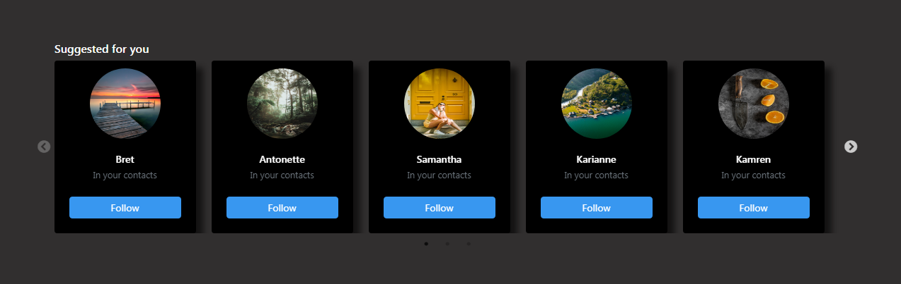

# Instagram Friend Suggestions Clone using React

> This project is made as a part of my experiments with react, This project features a Clone of the Instagram Suggestions Component replicated using react. Covers the use of Sliding components and the use of API's to generate Random names and Images in the Friends Suggestion Card.

# View Deployment

> Deployed using Vercel

- [Click to view](https://csb-dq12d-7y32xvzzj.vercel.app/)

## API References

- [JSON placeholder] (https://jsonplaceholder.typicode.com)
- [Unsplash] (https://source.unsplash.com/random/)
